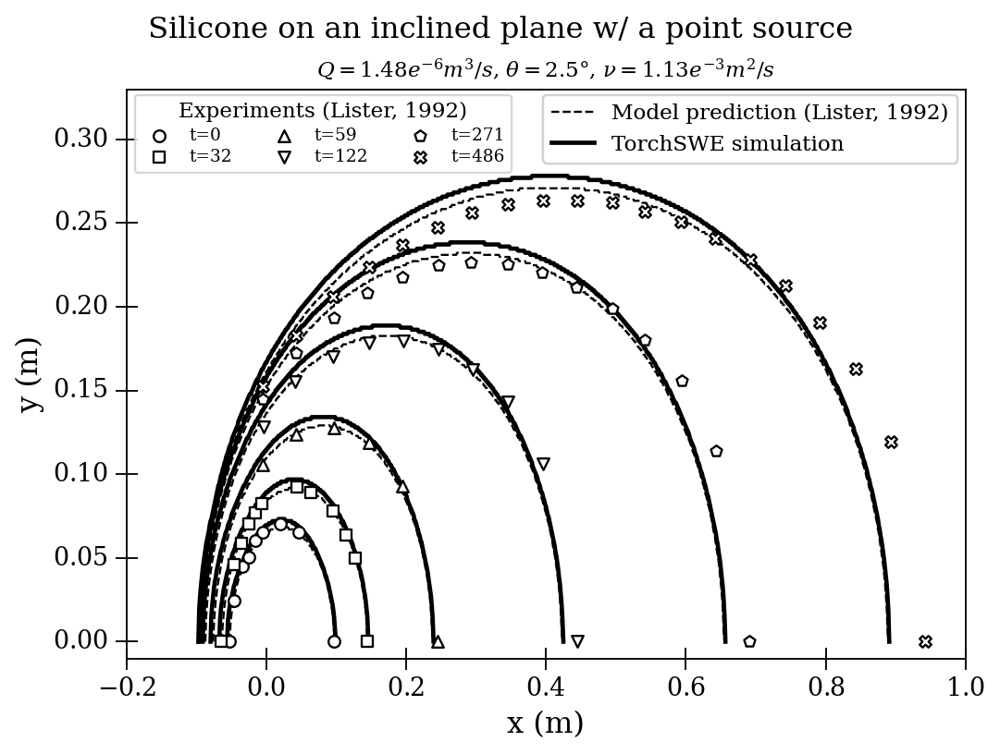

This case simulates a point source releasing silicone on an inclined plane. We
compare the results with the model predictions and experimental data from
Lister (1992). The case serves as a validation case.

| parameter | value |
| --- | --- | 
| point source's cooidinate | `(9.517784181422018e-4, 0)` |
| angle on the inclined plane | `2.5` degree |
| flow rate | `1.48e-6` m3 s-1 |
| kinematic viscosity | `1.13e-3` m2 s-1|
| surface roughness | `0` m |

Note that in the simulation, the `x` coordinate is defined in the downstream
direction but on a horizontal plane. On the contrary, the `x` in Lister's model,
experiments, and the figure below are defined on the inclined plane, though still
in the downstream direction. In other words, the point source is located at
`(0, 0)` in the figure below.

## Reference

Lister, J. R. (1992). Viscous flows down an inclined plane from point and line
sources. Journal of Fluid Mechanics, 242, 631-653.
